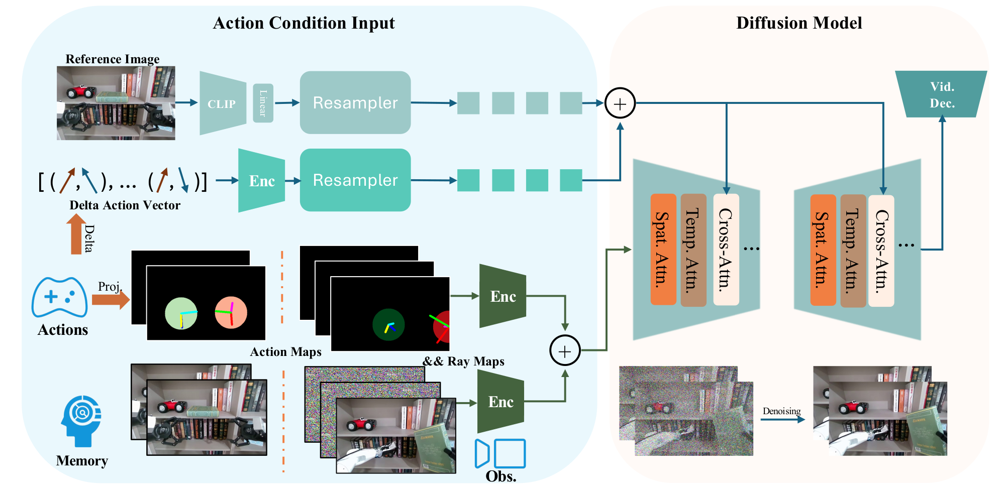

# ENERVERSE-AC: Envisioning Embodied Environments with Action Condition

<div id="top" align="center">



 <a href='https://arxiv.org/abs/2501.01895'></a> &nbsp; <a href='https://sites.google.com/view/enerverse'></a> &nbsp;  <a href='https://huggingface.co/agibot-world/EnerVerse-AC'></a> &nbsp;


</div>

This repo is the official implementation of EnerVerse-AC: Envisioning Embodied Environments with Action Condition, featuring minimal inference code to run single-view video generation.


## Getting started


### Setup
```
git clone https://github.com/AgibotTech/EnerVerse-AC.git
conda create -n enerverse python=3.10.4
conda activate enerverse
pip install -r requirements.txt`
```

### Inference

1. Download the single-view checkpoint from [EVAC](https://huggingface.co/agibot-world/EnerVerse-AC), and modify ``model.pretrained_checkpoint`` in ``configs/agibotworld/train_configs.yaml`` to the checkpoint file ``*.pt``

Note: Due to commercial restrictions on portions of the training data referenced in the paper, the released model weights were trained exclusively on the open-source [AgibotWorld dataset](https://github.com/OpenDriveLab/AgiBot-World) and do not include any failure trajectory data.

2. Download the weights of [CLIP](https://huggingface.co/laion/CLIP-ViT-H-14-laion2B-s32B-b79K) and modify ``model.params.img_cond_stage_config.params.abspath`` in ``configs/agibotworld/config.yaml`` to the absolute path to ``open_clip_pytorch_model.bin`` inside the download directory

3. Prepare necessary files, including one start frame, an action file (\*.npy), an extrinsic file (\*.npy), an intrinsic file (\*.npy). A simple convertation script from AgiBotWorld to the expected files is provided in tools/prepare_infer_data.py.

```
python tools/prepare_infer_data.py -r PATH_TO_AGIBOTWORLD_ROOT -t TASK_ID -e EPISODE_ID -s SAVE_ROOT -j JSON_OF_ACTION_INDEXES_TO_EXTRACT -c CAM_NAME
```

4. Run the script

```
python main/generate_video_acwm.py -i IMAGE_FILE -a ACTION_FILE -ex EXTRINSIC_FILE -in INTRINSIC_FILE -s SAVE_ROOT --ckp_path PATH_TO_CHECKPOINT --config_path PATH_TO_CONFIG
```

We provide processed examples in ``examples/examples*`` to clarify the usage of the script, you can run inferencing script like:
```
python main/generate_video_acwm.py -i examples/examples0/frame.png -a examples/examples0/action.npy -ex examples/examples0/extrinsics.npy -in examples/examples0/intrinsics.npy -s ./result_video_root --ckp_path PATH_TO_CHECKPOINT --config_path PATH_TO_CONFIG
```


### Related Works
This project draws inspiration from the following projects:
- [EnerVerse](https://sites.google.com/view/enerverse)
- [DynamiCrafter](https://github.com/Doubiiu/DynamiCrafter)
- [LVDM](https://github.com/YingqingHe/LVDM)


### Citation
Please consider citing our paper if our codes are useful:
```bib
@article{huang2025enerverse,
  title={Enerverse: Envisioning Embodied Future Space for Robotics Manipulation},
  author={Huang, Siyuan and Chen, Liliang and Zhou, Pengfei and Chen, Shengcong and Jiang, Zhengkai and Hu, Yue and Liao, Yue and Gao, Peng and Li, Hongsheng and Yao, Maoqing and others},
  journal={arXiv preprint arXiv:2501.01895},
  year={2025}
}
```


## License
All the data and code within this repo are under [CC BY-NC-SA 4.0](https://creativecommons.org/licenses/by-nc-sa/4.0/).
